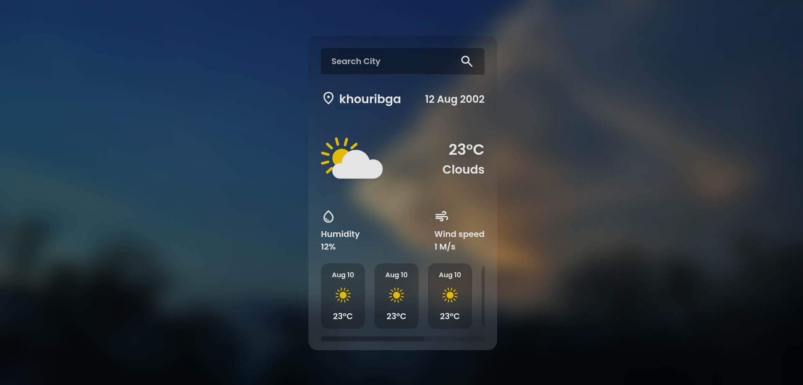

<div align="center">
  
</div>

---

## Live Demo

[Weather App](https://weatherapppa.netlify.app/)

# 🌦️ Weather App

- A simple weather application built with **HTML, CSS, and JavaScript**.  
- It uses the [OpenWeather API](https://openweathermap.org/api) to fetch real-time weather data.
- And for the cities i used [Getpostman](https://documenter.getpostman.com/view/1134062/T1LJjU52) to fetch countries and cities.

---

## ✨ Features
- Search weather by city name  
- Show **current temperature, weather description, and icons**  
- Display **5-day forecast** 
- Responsive design (works on desktop & mobile)  

---

## 🛠️ Technologies Used
- **HTML5** for structure  
- **CSS3** for styling  
- **JavaScript (ES6)** for functionality  
- **OpenWeather API** for weather data  

---

   ```bash
   git clone https://github.com/NzrrS/Weather-App.git
